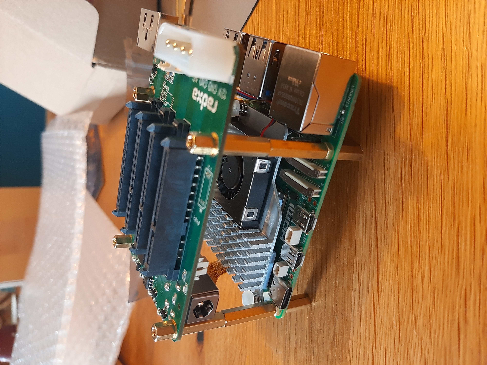
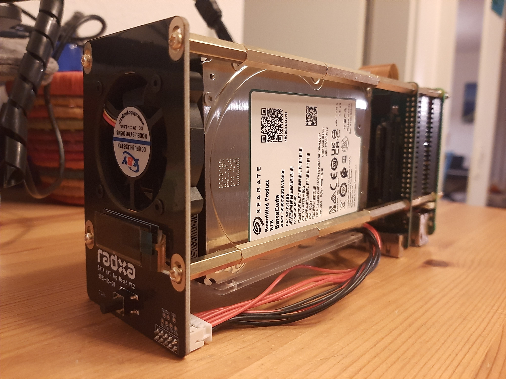

Prepare System
--------------

    ## System Updates (Raspberry Pi OS Lite Bookworm)
    $ sudo apt update
    $ sudo apt full-upgrade

    ## Additional Packages
    $ sudo apt install mc vim htop screen tree ncdu bc
    $ sudo apt install rsnapshot unison
    $ # sudo apt install b2sum  # see compare_directories.sh => not faster than sha256sum
    $ # sudo apt install restic  # much older than https://github.com/restic/restic/releases/

Check/Deactivate Swap
---------------------

    ## Check usage
    $ swapon -s
    $ free -m

    ## Deactivate swap
    $ sudo dphys-swapfile swapoff
    $ sudo dphys-swapfile uninstall
    $ sudo systemctl disable dphys-swapfile
    $ sudo service dphys-swapfile stop
    $ sudo update-rc.d dphys-swapfile remove

    ## Adjust swappiness (lower swappiness => less swapping)
    $ sudo sysctl vm.swappiness
        vm.swappiness = 1
    $ sudo sysctl vm.swappiness=0
        vm.swappiness = 0

Install Radxa Penta SATA + top board
------------------------------------

    ## 1) Activate I2C & PCIe Gen3 w/ raspi-config
    $ sudo raspi-config
        > Interface Options > I2C > Yes  # Penta SATA HAT top board button
        > Advanced Options > PCIe Speed > Yes

    ## 2) Activate I2C & PCIe Gen3 manually
    $ sudo vim /boot/firmware/config.text
        # Uncomment some or all of these to enable the optional hardware interfaces
        dtparam=i2c_arm=on
        #dtparam=i2s=on
        #dtparam=spi=on
        [...]
        [all]
        # Enable the PCIe External connector.
        dtparam=pciex1
        # Force Gen 3.0 speeds
        dtparam=pciex1_gen=3

    ## Install top board Package
    ## https://docs.radxa.com/en/accessories/penta-sata-hat/sata-hat-top-board
    $ sudo apt update
    $ sudo apt install wget
    $ wget https://github.com/radxa/rockpi-penta/releases/download/v0.2.2/rockpi-penta-0.2.2.deb
    $ sudo apt install -y ./rockpi-penta-0.2.2.deb

Reboot
------

    $ sudo reboot

Install OpenMediaVault (OMV)
----------------------------

    ## https://linuxconfig.org/how-to-install-openmediavault-on-raspberry-pi
    ## https://blog.berrybase.de/openmediavault-auf-den-raspberrypi-nas/

    ## Use cable connection, because Wifi will be deactivated during setup
    $ wget -O - https://raw.githubusercontent.com/OpenMediaVault-Plugin-Developers/installScript/master/install | sudo bash
    $ sudo systemctl start nginx
    $ sudo systemctl enable nginx
    ## Default login: admin/openmediavault

    ## Re-enable power button
        > System > Power Management > Settings
            Power button: Power Off

    ## Re-enable wifi
        > Network > Interfaces > (+) | Edit

Setup RAID Storage
------------------

    ## Create key file
    ## a) binary key
    $ dd bs=512 count=1 if=/dev/urandom of=cryptkey_urandom iflag=fullblock
    ## b) RSA key
    $ openssl genrsa 4096 -out cryptkey_rsa
    $ chmod 400 cryptkey_*

    ## Create master passphrase (needed for creation of LUKS container)
    ## Take note of the master passphase (will be required for doing any modification)!
    $ MASTER_PASS=$(tr -dc A-Za-z0-9 </dev/urandom | head -c 12)
    $ echo "$MASTER_PASS"

    ## Create LUKS containers (pipe passphrase to avoid typing)
    $ lsblk
    $ echo "$MASTER_PASS" | sudo cryptsetup luksFormat /dev/sda
    $ echo "$MASTER_PASS" | sudo cryptsetup luksFormat /dev/sdb
    $ echo "$MASTER_PASS" | sudo cryptsetup luksAddKey /dev/sda cryptkey_rsa
    $ echo "$MASTER_PASS" | sudo cryptsetup luksAddKey /dev/sdb cryptkey_rsa

    ## Dump LUKS container headers
    $ sudo cryptsetup luksDump /dev/sda
    $ sudo cryptsetup luksDump /dev/sdb

    ## Open/Decrypt LUKS containers
    $ sudo cryptsetup open --key-file=cryptkey_rsa --type luks /dev/sda data1
    $ sudo cryptsetup open --key-file=cryptkey_rsa --type luks /dev/sdb data2

    ## 1) Create and mount file system w/ OMV
        > Storage > File Systems > (+) Create and mount a file system
            Type BTRFS
            Profile RAID1
            Devices /dev/mapper/data1, /dev/mapper/data2

    ## 2) Create file system manually
    $ sudo mkfs.btrfs -m raid1 -d raid1 /dev/mapper/data1 /dev/mapper/data2

    ## Finetune /etc/fstab
    $ sudo vim /etc/fstab
        proc                /proc           proc    defaults 0 0
        PARTUUID=SDCARD-01  /boot/firmware  vfat    defaults 0 2
        PARTUUID=SDCARD-02  /               ext4    noatime,nodiratime,defaults 0 1
        ## OMV > Storage > File Systems > (+) Create and mount a file system
        # >>> [openmediavault] 
        # /dev/disk/by-uuid/<RAID-UUID>     /mnt/data   btrfs   defaults,nofail,noatime 0 2
        # <<< [openmediavault]
        #
        ## RAID 5TB (testing/debugging)
        # UUID=<RAID-UUID>      /mnt/data/  btrfs   defaults,nofail,noatime,noauto 0 2
        #
        ## eSATA 16TB (backup)
        # UUID=<eSATA-UUID>     /mnt/esata/ btrfs   defaults,nofail,noatime,noauto 0 2
        #
        ## no swap partition, use swapfile instead
        ## $ sudo dphys-swapfile swap[on|off]

    ## Mount RAID using /etc/fstab
    $ sudo mount /dev/mapper/data1
    $ sudo mount /dev/mapper/data2
    $ sudo mount /mnt/data
    ## Mount RAID manually
    $ mount -t btrfs -o defaults,nofail,noatime /dev/disk/by-uuid/<RAID-UUID> /mnt/data

    ## Show filesystem informations (similar to `mdadm --detail <device>`)
    $ sudo btrfs filesystem show
    $ sudo btrfs filesystem df /mnt/data
    $ sudo brrfs filesystem usage /mnt/data

Setup Auto-Decrypt on Boot
--------------------------

    $ sudo vim /etc/rc.local
        [...]
        ## Decrypt and mount data
        bash /home/pi/bin/unlock_LUKSdata.sh

        exit 0

Setup & Start miniDLNA on Boot
------------------------------

    $ sudo vim /etc/minidlna.conf
        [...]
        # Path to the directory you want scanned for media files.
        #
        # This option can be specified more than once if you want multiple directories
        # scanned.
        #
        # If you want to restrict a media_dir to a specific content type, you can
        # prepend the directory name with a letter representing the type (A, P or V),
        # followed by a comma, as so:
        #   * "A" for audio    (eg. media_dir=A,/var/lib/minidlna/music)
        #   * "P" for pictures (eg. media_dir=P,/var/lib/minidlna/pictures)
        #   * "V" for video    (eg. media_dir=V,/var/lib/minidlna/videos)
        #   * "PV" for pictures and video (eg. media_dir=PV,/var/lib/minidlna/digital_camera)
        #media_dir=/var/lib/minidlna
        #media_dir=A,/mnt/data/Music
        #media_dir=P,/mnt/data/Photos
        media_dir=V,/mnt/data/Videos
        [...]

    $ sudo vim /etc/rc.local
        [...]
        ## Start minidlna server when data is mounted
        if mount | grep /mnt/data > /dev/null; then
          printf "\n>>>> Starting MiniDLNA ...\n"
          systemctl start minidlna.service
        else
          false
        fi

        exit 0

Backup OMV Configuration
------------------------

    $ sudo cp /etc/openmediavault/config.xml etc_openmediavault_config.xml

